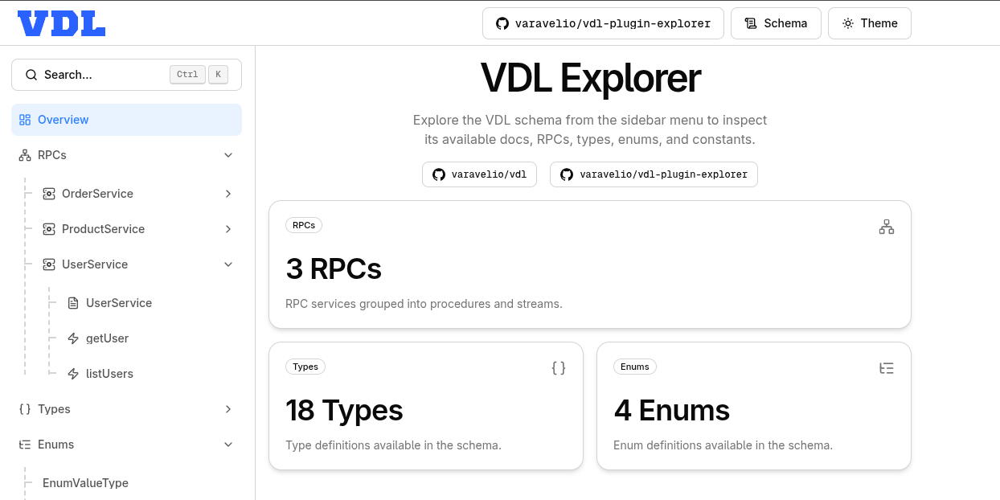

<p align="center">
  
</p>

<h1 align="center">VDL Explorer Plugin</h1>

<p align="center">
  Generate a single-file HTML explorer for VDL <strong>docs</strong>, <strong>RPCs</strong>, <strong>types</strong>, <strong>enums</strong>, and <strong>constants</strong>.
</p>

<p align="center">
  <a href="https://varavel.com">
    
  </a>
  <a href="https://varavel.com/vdl">
    
  </a>
</p>

This plugin turns your VDL schema into a standalone, shareable explorer UI.

Use it when you want to:

- share schema docs with teammates, clients, or external partners
- browse docs, RPCs, types, enums, and constants in one place
- inspect RPC services, procedures, and streams with input/output previews
- ship a responsive schema reference as a single HTML file that can be hosted anywhere

## Demo

[Open the live demo](https://vdl-explorer-demo.varavel.com/) or explore [it's source code](https://github.com/varavelio/vdl-plugin-explorer/tree/main/demo).



## Quick Start

1. Add the plugin to your `vdl.config.vdl`:

```vdl
const config = {
  version 1
  plugins [
    {
      src "varavelio/vdl-plugin-explorer@v0.1.0"
      schema "./schema.vdl"
      outDir "./docs"
    }
  ]
}
```

2. Run your normal VDL generation command:

```bash
vdl generate
```

3. Check the generated `index.html` output in `./docs`

By default, the plugin writes one self-contained HTML file inside your `outDir`.

## Plugin Options

All options are optional.

| Option    | Type     | Default        | What it changes                                                            |
| --------- | -------- | -------------- | -------------------------------------------------------------------------- |
| `outFile` | `string` | `"index.html"` | Sets the output filename inside `outDir`. The value must end with `.html`. |

Example with all options:

```vdl
const config = {
  version 1
  plugins [
    {
      src "varavelio/vdl-plugin-explorer@v0.1.0"
      schema "./schema.vdl"
      outDir "./docs"
      options {
        outFile "schema-explorer.html"
      }
    }
  ]
}
```

## What You Get

- One standalone HTML file with the full explorer UI embedded.
- Overview dashboard with counts for docs, RPCs, types, enums, and constants.
- Sidebar navigation grouped by resource kind.
- Dedicated pages for docs, RPC services, RPC operations, types, enums, and constants.
- Full-text search across titles, names, docs, summaries, and VDL source snippets.
- Syntax-highlighted VDL source rendering.
- Internal cross-links between referenced schema nodes.
- Light and dark theme support.
- Responsive layout that works well on desktop and mobile.

## RPC Annotation Model

This plugin recognizes RPC pages from the standard VDL RPC annotations:

- `@rpc` marks a top-level type as an RPC service.
- `@proc` marks a field as a request-response operation.
- `@stream` marks a field as a server-streaming operation.

Example:

```vdl
@rpc
type Messages {
  @proc
  send {
    input {
      roomId string
      text string
    }

    output {
      accepted bool
    }
  }

  @stream
  events {
    input {
      roomId string
    }

    output {
      text string
      createdAt datetime
    }
  }
}
```

When RPC services are present, the explorer includes:

- one page per RPC service
- one page per procedure or stream operation
- input and output VDL source previews for each operation

## Output Behavior

- The plugin always emits a single HTML file.
- The generated explorer embeds the VDL IR directly into the page, so there are no extra runtime assets to host.
- Source position metadata is omitted from the embedded IR to keep the output smaller and cleaner.
- The generated code snippets are canonical VDL code without syntactic sugar, so they may differ from the original source code.
- If `outFile` does not end with `.html`, generation fails with a clear error.

## Notes

- Docs are rendered from your schema markdown blocks.
- The explorer is well suited for internal documentation portals, handoff artifacts, release bundles, and client-facing schema references.

## License

This plugin is released under the MIT License. See [LICENSE](LICENSE).
